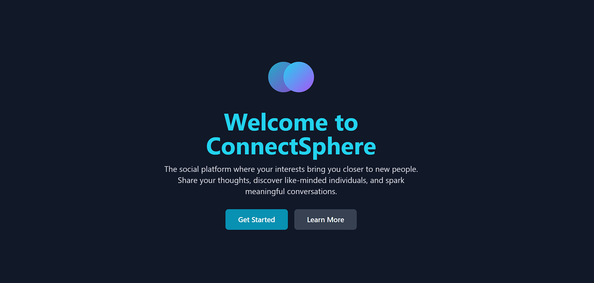
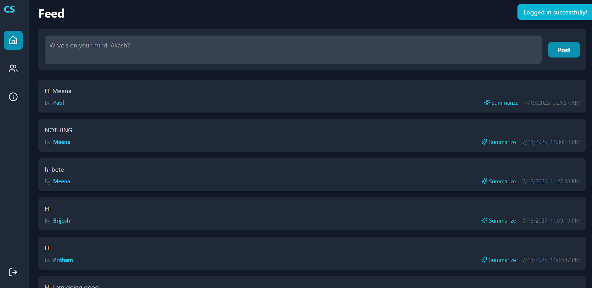
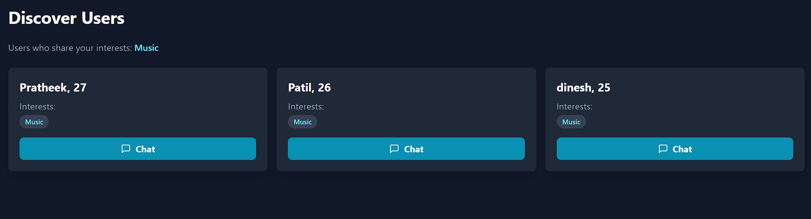
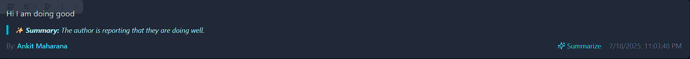
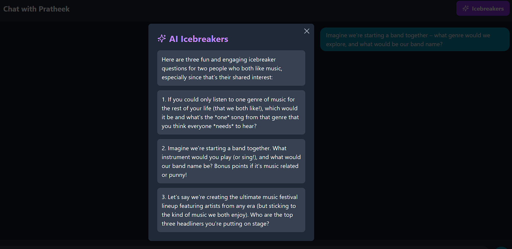

# ConnectSphere: An Interest-Based Social Platform
ConnectSphere is a modern, fullstack social media application designed to connect users based on their shared interests. It features a real-time feed, user discovery, private chat, and is enhanced with AI-powered features using the Google Gemini API to make interactions more engaging.

<!-- It's recommended to add a screenshot or logo here -->

# ✨ Features
User Authentication: Secure sign-up and login functionality using Firebase Authentication.

# User Profiles: Users can set their name, age, and a list of personal interests.

# Public Feed: A real-time public feed where any user can post their thoughts and see posts from others.

# Interest-Based Discovery: A "Discover" page that intelligently suggests other users with at least one shared interest.

# Real-Time Private Chat: Secure, one-on-one chat functionality between users, built with Firestore.

# 🤖 AI Post Summarizer: Utilizes the Gemini API to provide a quick, one-sentence summary of any post on the feed.

# 🤖 AI Icebreakers: Generates three unique and relevant conversation starters in the chat window based on the shared interests of the two users.

Responsive Design: A clean, modern, and fully responsive UI built with Tailwind CSS.

# 🛠️ Tech Stack
Frontend: React (Create React App)

Backend: Node.js with Express (as a secure proxy for API keys)

Database: Google Firestore (for user data, posts, and chats)

Authentication: Firebase Authentication

Styling: Tailwind CSS

AI: Google Gemini API

# 📂 Project Structure
The project is organized as a monorepo with two main directories:

/client: Contains the frontend React application.

/server: Contains the backend Node.js Express proxy server.

/connectsphere-fullstack
├── client/          <-- React App
├── server/          <-- Node.js Proxy
└── package.json     <-- Root package to run both client & server

# 🚀 Setup and Installation
Follow these steps to get the project running locally on your machine.

1. Clone the Repository
git clone https://github.com/your-username/connectsphere-fullstack.git
cd connectsphere-fullstack

2. Set Up Environment Variables
You will need to create two .env files—one for the server and one for the client.

A. Server Environment Variables:

Create a file named .env inside the /server directory.

Add your Google Gemini API key to this file.

server/.env:

GEMINI_API_KEY=your_gemini_api_key_here

B. Client Environment Variables:

Create a file named .env inside the /client directory.

Add your Firebase project configuration keys here. All keys must start with REACT_APP_.

client/.env:

REACT_APP_FIREBASE_API_KEY=your_firebase_api_key
REACT_APP_FIREBASE_AUTH_DOMAIN=your_firebase_auth_domain
REACT_APP_FIREBASE_PROJECT_ID=your_firebase_project_id
REACT_APP_FIREBASE_STORAGE_BUCKET=your_firebase_storage_bucket
REACT_APP_FIREBASE_MESSAGING_SENDER_ID=your_firebase_messaging_sender_id
REACT_APP_FIREBASE_APP_ID=your_firebase_app_id
REACT_APP_FIREBASE_MEASUREMENT_ID=your_firebase_measurement_id

3. Install Dependencies
From the root (/connectsphere-fullstack) directory, run the install-all script. This will install all necessary packages for the root, client, and server.

npm run install-all

4. Run the Application
From the root directory, run the dev script. This will start both the backend server and the frontend React app concurrently.

npm run dev

The React app will be available at http://localhost:3000.

The Node.js server will be running on http://localhost:3001.

# ☁️ Deployment
This application is designed to be easily deployed to services like Render.

Deploy the Server: Deploy the /server directory as a Web Service. Remember to add your GEMINI_API_KEY as an environment variable in the Render dashboard.

Deploy the Client: Deploy the /client directory as a Static Site. Add all your REACT_APP_... Firebase keys as environment variables in the Render dashboard.

Set Up Rewrites: In your Static Site settings on Render, add a rewrite rule to direct API traffic from the frontend to the backend.

Source: /api/*

Destination: https://your-backend-service-url.onrender.com/api/*

This setup ensures that your API keys remain secure and are not exposed in the frontend code.
